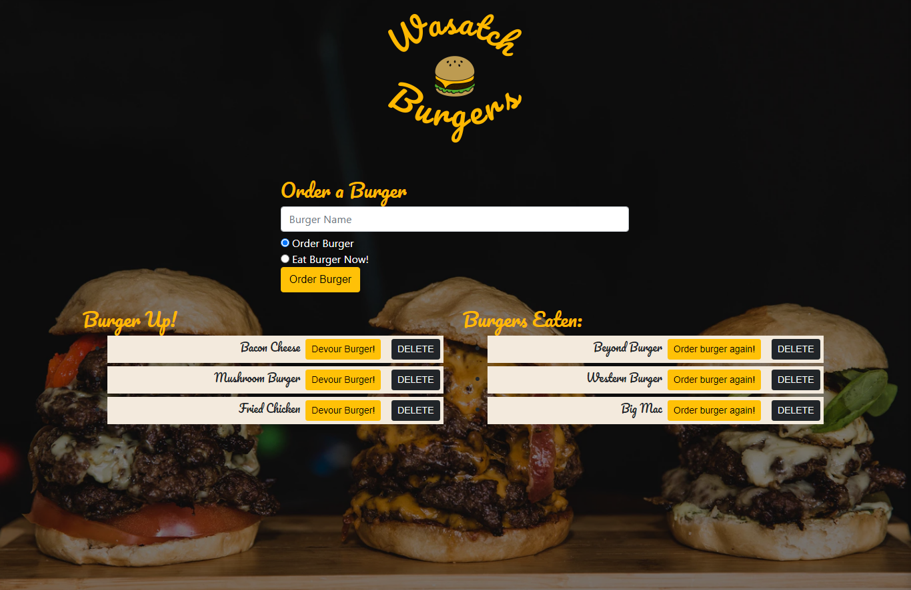

# Wasatch-Burgers

## Description

Wasatch Burgers is a restaurant app that lets users input the names of burgers they'd like to eat. The app allows the user to use a burger logger with MySQL, Node, Express, Handlebars and a homemade ORM (yum!). The app follows the MVC design pattern; uses Node and MySQL to query and route data in the app, and Handlebars to generate the HTML.

This app is deployed on [Heroku](https://wasatch-burgers.herokuapp.com/).

---

## Table of Contents (Optional)

- [Installation](#installation)
- [Usage](#usage)
- [Links](#links)
- [License](#license)
- [Contact](#questions)

---

## Installation

1. Download or clone repository
2. `npm install` to install the required npm packages to run
3. To have a pre-populated database, run `npm seed`

---

## Usage

- Application will be invoked by using the following command:

  `npm start`

- Open your browser and go to
  
  `http://localhost:8080`

  The home page the user will have the option to:
   - **Order a Burger**
   - **See a list of burgers ordered**
   - **Devour a Burger** 
   - **See a list of previously eaten burgers**
   - **Reorder a burger**
   - **Delete a Burger**

---
## Links
* [Github](https://github.com/ryanhadfield/Wasatch-Burgers)
* [Heroku](https://wasatch-burgers.herokuapp.com/)

---

## License

Copyright (c) Ryan Hadfield. All rights reserved.
  
Licensed under the [MIT](LICENSE) license.

---

## Questions

Github: https://github.com/ryanhadfield

Email: Ryan.Hadfield@gmail.com